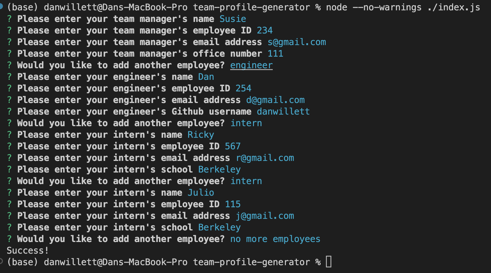

# Team-Profile-Generator

## Description

This application enables a software engineering team to quickly generate an html page with summary information for each team member. Since potential clients or prospective employees may want to research the the team, it is important to include have a webpage displaying basic contact information. Furthermore, using a simple application like this will ensure the software engineering team can maximize their time on projects they care about rather than maintaing their web page. 

## Table of Contents

- [Installation](#installation)
- [Usage](#usage)
- [Credits](#credits)
- [License](#license)

## Installation

To install this project, clone this repository onto your local machine. You need to make sure you have nodeJS installed. Before running the application, make sure to run npm install to download the necessary inquirer and jest packages.

## Usage

Navigate to the team-profile-generator directory in your terminal and run `npm i` to install necessary packages. Then run `node index` to start the application.

Once the application runs, you will be prompted to answer basic questions about your teams manager such as name, employee id, email, and room number. You will then be prompted to either add an engineer position, intern position, or finish your webpage. When you add a new engineer or intern position, you will be prompted to answer questions about these positions and will have the option to add an additional position when you have finished answering the questions.

When you select decide to finish your profiles, your html file will be created.

## Credits

CSS styling:
boostrap@5.1.3 : https://getbootstrap.com/

## License

MIT license : https://opensource.org/licenses/MIT

## Tests

There are 4 test that make sure the position Classes used in this application are running properly. Run npm test -- --verbose to ensure the tests are passing. 